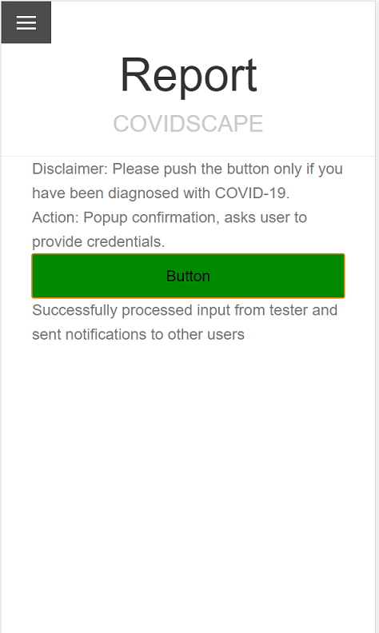
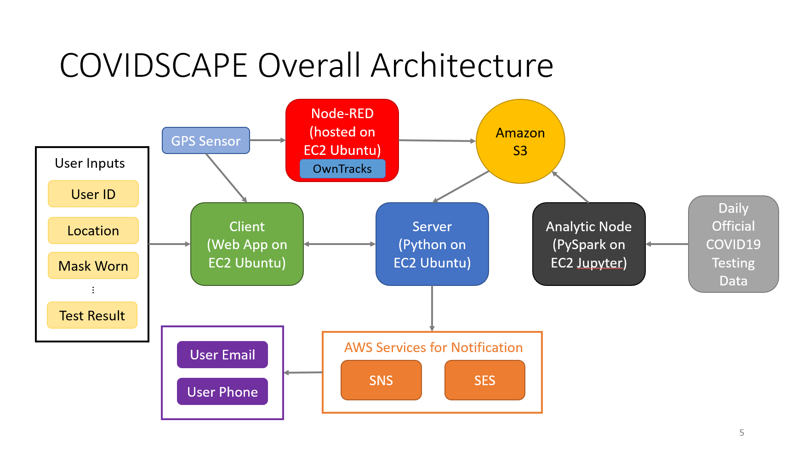

# COVIDSCAPE
COVIDSCAPE is a project for the class EE542: Internet and Cloud Computing. It is a COVID-19 risk prediction service. It is web-hosted and supports a location-based, personalized risk score calculation based on reputable COVID-19 information sources. Additionally, Covidscape leverages the user location data it obtains to further implement contact tracing on diagnosed users and notifies other users of potential contact. 

COVIDSCAPE demonstrates a complete software ecosystem where we take advantage of Amazon Web Services (AWS), Node-Red datacollection, Machine Learning analytics and finally displayed on a friendly web-UI. Due to dataset constraints, we only provide prediction service in LA area currently.

This is the homepage of COVIDSCAPE. The first thing you see is this Google map and some circles. The circle's size represents COVID concentration in the area. Larger circle means there is a higher density of COVID infected population. The circles are also color coded by COVID growth rate. Red means increasing and Green decreasing. To the top left and top right is our localization functionality. Use it to select the interested location. Now below the map, choose the options to best reflect the COVID precautions at that location. It is possible to choose to predict future risk scores, if you don’t want to visit the place right now. After clicking 'Predict', the server will return a final score.

Next is the Report page. Users who are diagnosed with COVID can press this button to notify others who were in close contact with them to be careful.
Click the button, enter your username and it will utilize AWS to send out an SMS and email notification. This also shows COVIDSCAPE UI on mobile devices.

Finally this shows the overall architecture of COVIDSCAPE software system.

To learn further details of our implementation, including Machine Learning methodology and Node-Red data collection, please find the full demonstration of COVIDSCAPE on Youtube at the links below: 

https://youtu.be/Fg1HjYlPIEs

https://youtu.be/F_lyYlsTkUk (Backup)

